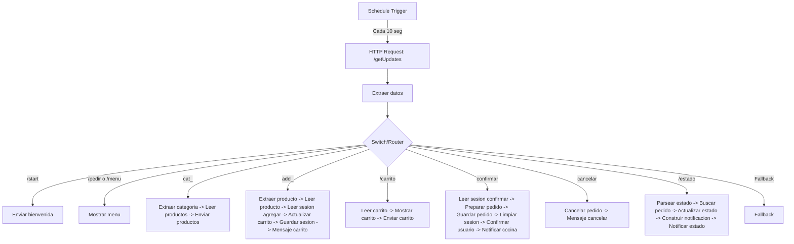

# 🤖 DeliveryBot Cafetería — Plataforma de Pedidos Conversacionales en Telegram con n8n

¡Bienvenido al proyecto **DeliveryBot Cafetería**! Esta solución modular automatiza y optimiza la gestión de pedidos dentro de entornos institucionales (como universidades, oficinas corporativas o comedores grandes), eliminando las filas de espera físicas y automatizando la recepción de pedidos en cocina, la gestión de inventarios y los reportes de administración en tiempo real.

El proyecto está diseñado bajo una arquitectura sin servidores (*serverless*) centrada en **n8n**, utilizando **Telegram** como la interfaz de usuario conversacional y **Google Sheets** como la base de datos centralizada.

---

## 📋 Tabla de Contenidos
1. [Características del Sistema](#-características-del-sistema)
2. [Modelo de Datos (Google Sheets: DeliveryBot_DB)](#-modelo-de-datos-google-sheets-deliverybot_db)
3. [Arquitectura del Flujo en n8n](#-arquitectura-del-flujo-en-n8n)
4. [Control de Bucles y Polling de Telegram](#-control-de-bucles-y-polling-de-telegram)
5. [Mejoras y Correcciones Implementadas](#-mejoras-y-correcciones-implementadas)
6. [Instrucciones de Despliegue](#-instrucciones-de-despliegue)

---

## 🚀 Características del Sistema

1. **Interfaz Conversacional e Interactiva:** Permite explorar el menú por categorías mediante comandos o clics en teclados interactivos directamente en Telegram.
2. **Carrito de Compras Persistente:** Mantiene un registro temporal de los productos añadidos por el usuario mediante un sistema de control de sesiones.
3. **Validación de Stock en Tiempo Real:** Previene la compra de productos agotados y alerta al usuario si su pedido excede la cantidad disponible de un producto antes de agregarlo al carrito.
4. **Ciclo de Vida de Pedidos Dinámico:** Permite a la cocina y administradores cambiar el estado del pedido (`Recibido` ➔ `Preparación` ➔ `En camino` ➔ `Entregado`) notificando instantáneamente al cliente.
5. **Base de Datos No-Code:** Totalmente gestionable desde Google Sheets para facilitar actualizaciones de menú sin necesidad de alterar código.
6. **Gestión de Horarios:** El bot informa automáticamente a los usuarios si intentan interactuar fuera del horario de atención (Lunes a Viernes, 8am a 5pm).

   

---

## 📊 Modelo de Datos (Google Sheets: DeliveryBot_DB)

El flujo de n8n requiere un libro de cálculo de Google Sheets con las siguientes cuatro hojas configuradas:

### 1. MENU
Registra los productos que se ofrecen en la cafetería e indica su inventario disponible.
*   `id_producto` *(Texto)*: Identificador único (ej: `BEB-001`, `ALM-002`, `SNK-003`).
*   `nombre` *(Texto)*: Nombre visible en el catálogo.
*   `descripcion` *(Texto)*: Breve detalle comercial.
*   `precio` *(Número)*: Valor monetario unitario del producto.
*   `categoria` *(Texto)*: Categoría organizadora (ej: `Bebidas`, `Almuerzos`, `Snacks`).
*   `stock` *(Número)*: Unidades disponibles.

### 2. PEDIDOS
Guarda el historial de todas las órdenes enviadas por los usuarios.
*   `id_pedido` *(Texto)*: Código de orden único (formato `ORD-AAAAMMDD-RAND`).
*   `id_usuario` *(Texto/Número)*: ID único de Telegram del usuario que ordena.
*   `detalles_pedido` *(Texto JSON)*: Array JSON con los productos pedidos (ej: `[{"id":"BEB-001","nombre":"Café","cantidad":2,"precio":1500}]`).
*   `total_pago` *(Número)*: Sumatoria total del costo de los productos.
*   `estado` *(Texto)*: Estado de preparación (`Recibido`, `Preparación`, `En camino`, `Entregado`).
*   `fecha` *(Texto/Fecha)*: Fecha de creación del pedido.
*   `hora` *(Texto/Hora)*: Hora exacta de creación del pedido.

### 3. USUARIOS
Registro general de clientes para programas de puntos o identificación departamental.
*   `telegram_id` *(Texto/Número)*: Identificador único del chat del usuario en Telegram.
*   `nombre_completo` *(Texto)*: Nombre que se recupera del perfil o registro inicial.
*   `departamento` *(Texto)*: Oficina o facultad a la que pertenece.
*   `puntos_lealtad` *(Número)*: Puntos acumulados por compras.

### 4. SESSIONS
Almacena el estado de sesión interactiva del usuario y sus compras actuales sin procesar.
*   `telegram_id` *(Texto/Número - Clave de Búsqueda)*: ID de Telegram del usuario.
*   `pantalla_actual` *(Texto)*: Estado de la interfaz conversacional (ej: `menu`, `carrito`).
*   `carrito_temporal` *(Texto JSON)*: Almacenamiento dinámico de los productos seleccionados antes de confirmar la compra.
*   `ultimo_cambio` *(Texto ISO Fecha)*: Marca de tiempo de su última interacción.

---

## 🛠️ Arquitectura del Flujo en n8n

El flujo está estructurado de manera modular y secuencial para optimizar el rendimiento de n8n y asegurar la robustez del servicio.



---

## ⚙️ Control de Bucles y Polling de Telegram

Para evitar consumir recursos innecesarios de webhook y eludir la necesidad de una IP pública expuesta (especialmente útil en entornos de desarrollo académico), el bot utiliza **Polling Activo** a través de un nodo **Schedule Trigger** configurado para ejecutarse cada 10 segundos.

Para evitar que los mismos mensajes sean procesados múltiples veces en cada ejecución de la cola, el nodo **HTTP Request** implementa un parámetro `offset` matemático y dinámico en sus parámetros de consulta (*Query Parameters*):

```text
Name: offset
Value: {{ $('Extraer datos').isExecuted ? (Number($('Extraer datos').first().json.update_id) + 1) : 0 }}
```

Esto asegura que Telegram limpie de su servidor todos los mensajes procesados con un `update_id` menor o igual al último procesado, garantizando que el bot solo atienda mensajes nuevos.

---

## 🔧 Mejoras y Correcciones Implementadas

En esta versión optimizada, se corrigieron problemas críticos detectados en el diseño original del flujo sin romper su estructura:

1.  **Mapeo de Variables y Sincronización:** Se eliminaron las inconsistencias entre `userId`/`chatId` y `chat_id`/`user_id`. El nodo `Extraer datos` ahora inyecta dinámicamente campos normalizados (`chat_id`, `user_id`, `first_name`) que persisten en todo el árbol de nodos.
2.  **Soporte Completo de Callback Queries (Teclado Inline):** El nodo `Extraer datos` fue reprogramado para recibir e interpretar tanto mensajes de texto tradicionales (`message.text`) como pulsaciones en botones interactivos de Telegram (`callback_query.data`), permitiendo el uso de botones de confirmación y selección rápida.
3.  **Refinamiento de Control de Stock:** El código en `Actualizar carrito` ahora realiza una validación lógica matemática comparando la cantidad agregada acumulativa del usuario en el carrito contra el stock de la tabla `MENU`. Si el stock es insuficiente, se notifica de forma limpia al usuario sin modificar la base de datos.
4.  **Corrección en el Nodo Guardar Sesión:** Se direccionó la escritura correctamente a la pestaña `SESSIONS` utilizando el identificador único del usuario (`telegram_id`) y se estructuró el esquema completo para no causar errores de sobrescritura de campos.

---

## 🚀 Instrucciones de Despliegue

### 1. Preparar Google Sheets
1. Crea una hoja de cálculo en Google Drive llamada `DeliveryBot_DB`.
2. Crea cuatro pestañas con los nombres exactos: `MENU`, `PEDIDOS`, `USUARIOS` y `SESSIONS`.
3. Escribe los nombres de los encabezados (Fila 1) para cada hoja tal como se especificaron en la sección **Modelo de Datos**.
4. Copia el **Document ID** de la hoja de cálculo (se encuentra en la URL: `https://docs.google.com/spreadsheets/d/TU_ID_AQUI/edit`).

Link de la hoja de google sheets:  https://docs.google.com/spreadsheets/d/1SelVjA5cWgQ79ZrZOVPirwSzpd3kOHNyVlaFZf_VZ5Y/edit?usp=sharing

¡Disfruta del funcionamiento automatizado de tu **DeliveryBot Cafetería**! 🤖☕
